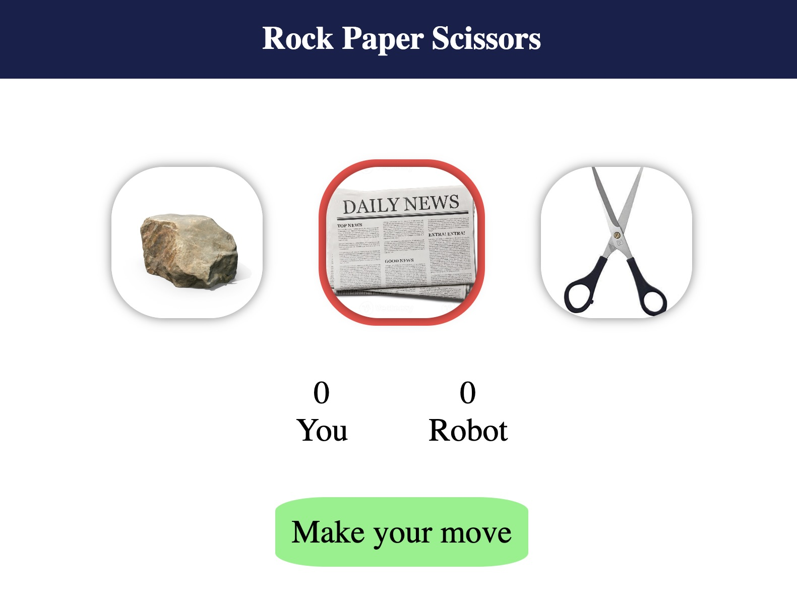
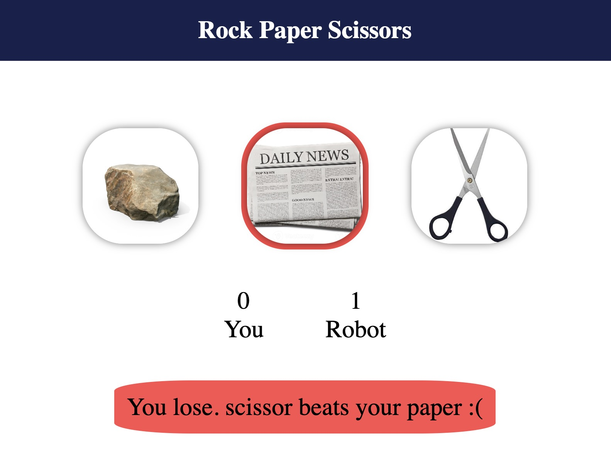
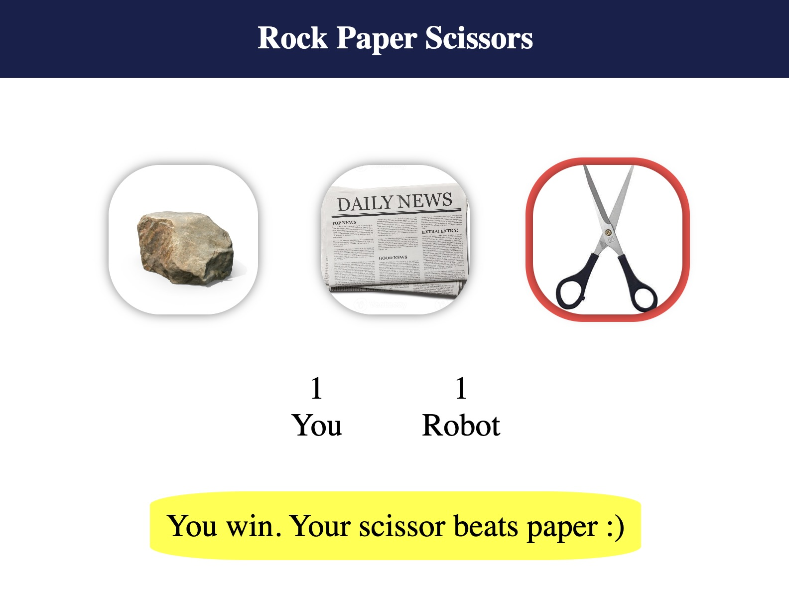
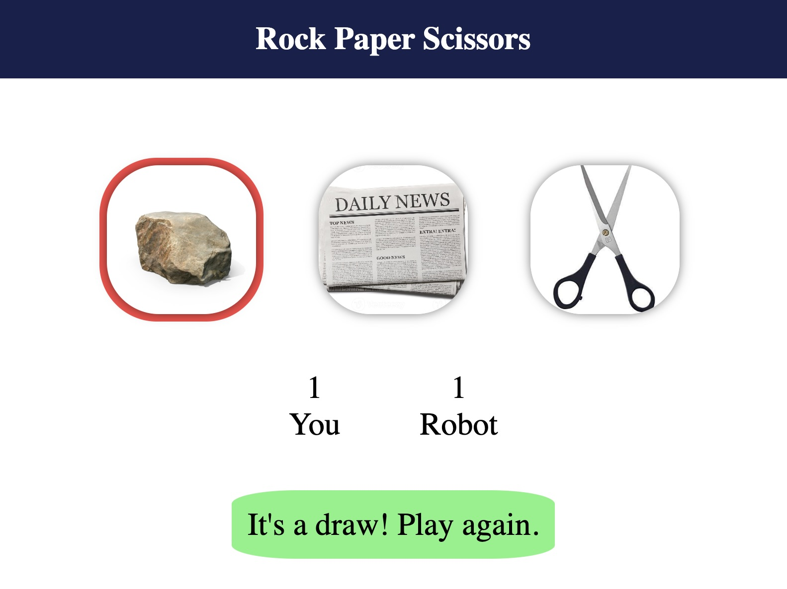

# Rock Paper Scissors Game

## Live Demo
Try it here:  
https://rock-paper-scissors-changmha.netlify.app/

## Description
This is a simple and interactive Rock Paper Scissors browser game built with HTML, CSS, and JavaScript.  
Play against the computer and see who wins each round. The game keeps track of scores and displays dynamic messages for wins, losses, and draws.

## Features
- Clickable rock, paper, and scissors choices with images  
- Real-time score tracking for both user and computer  
- Dynamic result messages after each round  
- Color-coded feedback: yellow for wins, red for losses, green for draws  
- Fully playable in the browser without installation  

## How to Play
1. Open the live demo in your browser  
2. Click on **Rock**, **Paper**, or **Scissors**  
3. Watch the score update and see the result  
4. Repeat and try to beat the computer  

## Tech Stack
- HTML5  
- CSS3  
- JavaScript (ES6)

## Screenshots

**Enjoy Gaming!**
